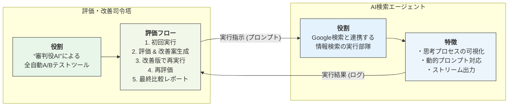

# AI-Powered Prompt Optimization Framework

## 概要

このプロジェクトは、AI（Google Gemini）を利用した情報検索タスクの性能を、**"審判役のAI"（LLM as a Judge）に評価・改善させる**ための、全自動A/Bテストフレームワークです。

良いプロンプト開発にありがちな「属人化」「時間コスト」「評価基準の曖昧さ」といった課題を、**「実行→評価→改善→再実行→比較」**というサイクルを自動化することで解決します。

### イメージ
パワポ
https://1drv.ms/p/c/135b66d476409d97/EZsra7MFu3FAolo4vOuwvMkB7rZSty9P--oLLV-mjV10wg?e=uKYQAu

### 主要な構成要素

1.  **評価・改善司令塔 (`advanced_evaluation_runner_log.py`)**
    *   プロジェクトのメインスクリプト。
    *   全体のプロセスを管理し、AI検索エージェントの性能を評価・改善します。

2.  **AI検索エージェント (`gemini_search_app_new_sdk.py`)**
    *   司令塔からの指示（プロンプト）に従って、実際に企業情報検索を実行するサブスクリプト。
    *   Google検索ツールと連携し、リアルタイムの情報を取得します。

3.  **APIキーマネージャー (`api_key_manager.py`)**
    *   複数のGoogle APIキーを安全にローテーションさせ、レートリミットを回避するためのシングルトンクラス。



## 特徴

*   **LLM as a Judge**: 人間の代わりにAIがAIの出力を評価することで、客観的で一貫性のある評価を実現。
*   **プロンプトの自己改善**: AIが自身の実行結果を分析し、より良い指示（プロンプト）を自動生成。
*   **定量的・定性的評価**: 「スコア」や「実行時間」といった数値と、「分析コメント」や「改善提案」という言葉の両面から多角的に評価。
*   **思考プロセスの可視化**: AIが何を考え、何を検索したかをリアルタイムで表示し、判断の透明性を確保。
*   **安全なAPIキー管理**: 複数のAPIキーを自動でローテーションし、APIのレートリミットを回避。
*   **徹底したログ管理**: 全ての実行プロセスとAIの出力を、企業名とタイムスタンプ付きのログファイルに保存。

## セットアップ

### 1. リポジトリのクローン

```bash
git clone https://github.com/your-username/your-repository.name.git
cd your-repository.name
```

### 2. 必要なライブラリのインストール

`requirements.txt`を使用して、必要なPythonライブラリをインストールします。

```bash
pip install -r requirements.txt
```

### 3. 環境変数の設定

プロジェクトのルートディレクトリに`.env`ファイルを作成し、お持ちのGoogle APIキーを設定します。キーは複数設定することができ、プログラムが自動でローテーションして使用します。
Google APIキーの取得は、こちらにアクセスしてください。（無料で取得できます。）
https://aistudio.google.com/apikey

**`.env` ファイルの例:**

```env
# 基本となるキー
GOOGLE_API_KEY="AIzaSy...your...first...key"

# 2つ目以降のキー (連番で設定)
GOOGLE_API_KEY_1="AIzaSy...your...second...key"
GOOGLE_API_KEY_2="AIzaSy...your...third...key"
# ... 必要なだけ追加
```

`api_key_manager.py`がこれらのキーを全て読み込み、管理します。

## 使い方

### 基本的な使い方（1社ずつのテスト）

メインスクリプトである`advanced_evaluation_runner_log.py`を実行します。引数として、調査したい企業名を渡してください。

```bash
python advanced_evaluation_runner_log.py "調査したい企業名　住所"
```

**実行例:**
```bash
python advanced_evaluation_runner_log.py "グーグル合同会社　住所"
```

### ファイルにテスト用データがあります。

プロジェクトには、テスト用の企業データが100件記述された`input_data_sample.txt`が用意されています。このファイルを使って、テストを実行できます。

**`input_data_sample.txt` の形式:**
企業情報は`###`または改行で区切られています。
```text
### 1. 	ダイレックス・ジャパン株式会社  大阪府大阪市西区新町１丁目２４番８号ノース四ツ橋ビル８Ｆ
### 2. 	原町製袋株式会社  大阪府大阪市中央区久太郎町４丁目１番３号
### 3. 	新日本サーマルセラミックス株式会社  大阪府堺市堺区戎島町４丁４５番地１ポルタスセンタービル１２階
...
```


## 実行プロセス

スクリプトを実行すると、以下のステップが自動で進行します。

1.  **初回実行**: デフォルトのプロンプトで`gemini_search_app_new_sdk.py`が実行されます。
2.  **初回評価**: 実行ログが分析され、評価レポートと「改善版プロンプト」が生成されます。
3.  **再実行**: 生成された「改善版プロンプト」を使って、再度`gemini_search_app_new_sdk.py`が実行されます。
4.  **2回目評価**: 再実行のログが分析され、評価レポートが作成されます。
5.  **最終比較**: 2つの評価レポートが比較され、総合的な分析結果がコンソールに出力されます。

## ログの確認

実行ログは、プロジェクトルートに作成される`log/`ディレクトリ内に保存されます。

*   ファイル名: `[企業名]_[実行開始日時].log`
*   内容: コンソールに出力された内容（AIの思考プロセス、最終回答、評価レポートなど）が全て記録されています。

## ライセンス

このプロジェクトは[MITライセンス](LICENSE.md)の下で公開されています。