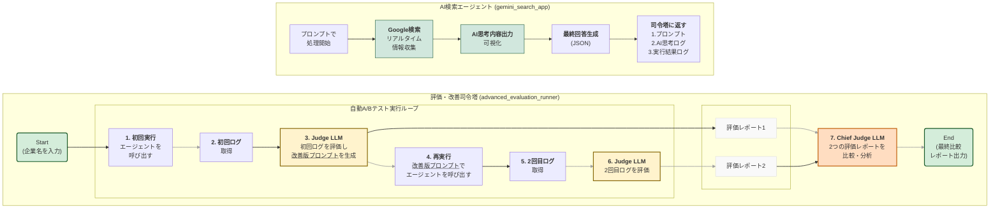

```mermaid
graph LR
    subgraph "評価・改善司令塔 (advanced_evaluation_runner)"
        direction LR

        Start("Start<br>(企業名を入力)")
        
        subgraph "自動A/Bテスト実行ループ"
            direction LR
            
            Run1["<b>1. 初回実行</b><br>エージェントを<br>呼び出す"]
            Log1["<b>2. 初回ログ</b><br>取得"]
            
            Judge1["<b>3. Judge LLM</b><br>初回ログを評価し<br><u>改善版プロンプト</u>を生成"]
            
            Run2["<b>4. 再実行</b><br><u>改善版プロンプト</u>で<br>エージェントを呼び出す"]
            Log2["<b>5. 2回目ログ</b><br>取得"]
            
            Judge2["<b>6. Judge LLM</b><br>2回目ログを評価"]
        end

        FinalJudge["<b>7. Chief Judge LLM</b><br>2つの評価レポートを<br>比較・分析"]
        End("End<br>(最終比較<br>レポート出力)")
        
        Start --> Run1
        Run1 --> Log1
        Log1 --> Judge1
        Judge1 --> Run2
        Run2 --> Log2
        Log2 --> Judge2
        
        subgraph " "
            direction TB
            Judge1_output["評価レポート1"]
            Judge2_output["評価レポート2"]
        end
        Judge1 --> Judge1_output
        Judge2 --> Judge2_output
        
        Judge1_output --> FinalJudge
        Judge2_output --> FinalJudge

        FinalJudge --> End
    end

    subgraph "AI検索エージェント (gemini_search_app)"
        direction LR

        AgentStart["プロンプトで<br>処理開始"]
        GoogleSearch["<b>Google検索</b><br>リアルタイム<br>情報収集"]
        Thinking["<b>AI思考内容出力</b><br>可視化"]
        GenAnswer["<b>最終回答生成</b><br>(JSON)"]
        AgentEnd["<b>司令塔に返す</b><br/>1.プロンプト<br/>2.AI思考ログ<br/>3.実行結果ログ"]

        AgentStart --> GoogleSearch --> Thinking --> GenAnswer --> AgentEnd
    end

    %% --- 司令塔とエージェントの関係性 ---

    %% --- スタイル定義 ---
    style Start fill:#D4EDDA,stroke:#155724,stroke-width:2px
    style End fill:#D4EDDA,stroke:#155724,stroke-width:2px
    
    style Judge1 fill:#FFF3CD,stroke:#856404,stroke-width:2px
    style Judge2 fill:#FFF3CD,stroke:#856404,stroke-width:2px
    style FinalJudge fill:#FFDDC1,stroke:#BF5B04,stroke-width:2px
    
    style GoogleSearch fill:#D1E7DD,stroke:#0F5132
    style Thinking fill:#D1E7DD,stroke:#0F5132

    style Judge1_output fill:#f9f9f9,stroke:#ddd
    style Judge2_output fill:#f9f9f9,stroke:#ddd

    linkStyle 0,2,4,6,9,11 stroke:#333,stroke-width:1.5px,color:black
    linkStyle 1,3,5,7,8,10 stroke:#A0A0A0,stroke-width:1.5px,color:black

```